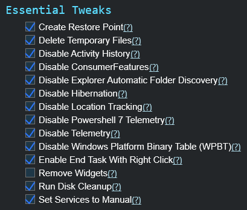

<p align="center">
  
</p>
<p align="center">
  <strong>WinRaze – Nexus Edition</strong>
</p>

<!-- Step 1: WinUtil images -->
<p align="center">
  
  
  
</p>
<p align="center">
  <strong>Step 1: These 3 images are from WinUtil.ps1</strong>
</p>

<!-- Step 2: Performance tweaks -->
<p align="center">
  
</p>
<p align="center">
  <strong>Step 2: System Performance Tweaks – Virtual Memory</strong><br>
  Press <kbd>Windows + R</kbd>, type <code>SystemPropertiesPerformance</code> and hit <kbd>Enter</kbd>.<br>
  Follow image 4, then go to <strong>Advanced → Virtual Memory → Change…</strong> window:<br>
  - Uncheck <strong>Automatically manage paging file size</strong>.<br>
  - Select your system drive (usually C:) → choose <strong>Custom size</strong>.<br>
  - Set the recommended sizes based on your RAM:
</p>

<p align="center">
  <strong>Examples:</strong><br>
  - <strong>8 GB RAM</strong> → Initial = 12 GB (12 × 1024 = 12288 MB), Maximum = 24 GB (24 × 1024 = 24576 MB)<br>
  - <strong>16 GB RAM</strong> → Initial = 24 GB (24 × 1024 = 24576 MB), Maximum = 48 GB (48 × 1024 = 49152 MB)<br>
  - <strong>32 GB RAM</strong> → Initial = 48 GB (48 × 1024 = 49152 MB), Maximum = 96 GB (96 × 1024 = 98304 MB)
</p>

<p align="center">
  Click <strong>Set → OK → Restart</strong> to apply.<br>
  Follow the steps shown in <strong>Performance.png</strong>.
</p>

# 🌌 WinRaze [Nexus Edition]
### Universal Optimization Suite for Windows 10 & 11

**WinRaze** is a high-performance PowerShell utility developed by **Rohit Kr. Mandal** (Alias: `CyberKun`). It is designed to "raze" system bloat to the ground, providing an S-Rank environment for gamers, developers, and power users.

[](https://github.com/Rohit5984/WinRaze-Optimize-10-11)


---

## 🛠 S-Rank Features
* **🔥 Neural-Raze:** Force-shuts unnecessary background services and optimizes the kernel for ultra-low latency.
* **🛡️ Ghost Protocol (Privacy Hardening):** Hard-locks Registry keys to block intrusive background permissions like Location, Call History, and Contacts.
* **💠 Nexus Interface:** A high-contrast, stylized terminal experience designed for the modern operator.

---

## 🚀 Quick Start (Infiltration Shortcut)

Run **WinRaze** instantly without manual downloads. 

1.  Press <kbd>Win</kbd> + <kbd>R</kbd> to open the **Run** dialog.
2.  Type `powershell` in the box.
3.  Press <kbd>Ctrl</kbd> + <kbd>Shift</kbd> + <kbd>Enter</kbd> to launch as **Administrator**.
4.  Copy the command below, paste it into the blue window, and hit **Enter**:

```powershell
irm https://raw.githubusercontent.com/Rohit5984/WinRaze-Optimize-10-11/main/WinRaze.ps1 | iex
