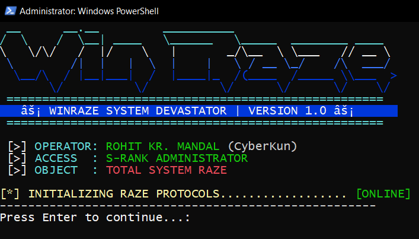
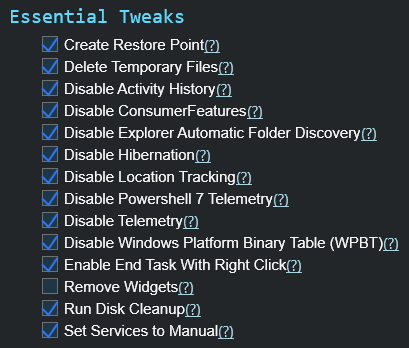
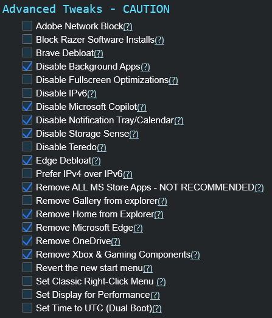
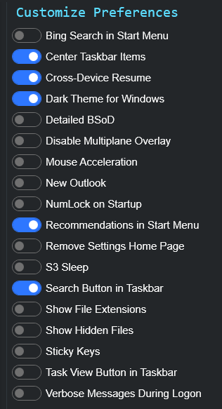
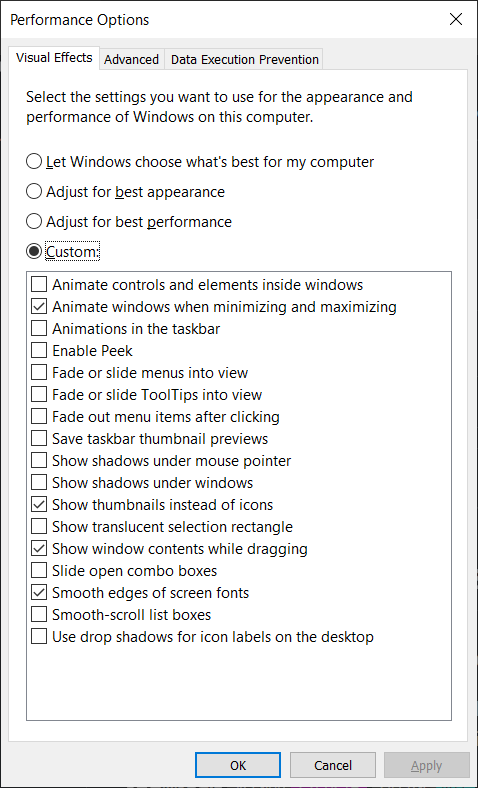
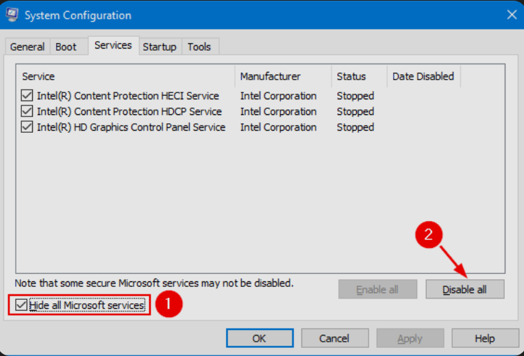

  

  <strong>WinRaze – Nexus Edition</strong>

<!-- Step 1: WinUtil images -->

  
  
  

  <strong>Step 1: These three images are from WinUtil.ps1</strong>

<!-- Step 2: Performance tweaks -->

  

  <strong>Step 2: System Performance Tweaks – Virtual Memory</strong> 
  Press <kbd>Windows + R</kbd>, type <code>SystemPropertiesPerformance</code>, and press <kbd>Enter</kbd>. 
  Follow the steps shown in the image, then open <strong>Advanced → Virtual Memory → Change…</strong> and:

  - Uncheck <strong>Automatically manage paging file size for all drives</strong>. 
  - Select your system drive (usually C:) and choose <strong>Custom size</strong>. 
  - Set the initial and maximum sizes based on your installed RAM:

  <strong>Examples</strong> 
  - <strong>8 GB RAM</strong> → Initial = 12 GB (12 × 1024 = 12288 MB); Maximum = 24 GB (24 × 1024 = 24576 MB). 
  - <strong>16 GB RAM</strong> → Initial = 24 GB (24 × 1024 = 24576 MB); Maximum = 48 GB (48 × 1024 = 49152 MB). 
  - <strong>32 GB RAM</strong> → Initial = 48 GB (48 × 1024 = 49152 MB); Maximum = 96 GB (96 × 1024 = 98304 MB).

  Click <strong>Set → OK</strong> to apply the changes. 
  Follow the steps shown in <strong>Performance.png</strong>.

<!-- Step 3: Registry Tweaks -->

  <strong>Step 3: Registry Performance Tweaks</strong> 
  Press <kbd>Windows + R</kbd>, type <code>regedit</code>, and press <kbd>Enter</kbd>. 

| Registry Path | Value | Change |
| :------------ | :---- | :----- |
| `HKCU\Control Panel\Mouse` | `MouseHoverTime` | `400 → 10` |
| `HKCU\Control Panel\Desktop` | `MenuShowDelay` | `400 → 10` |
| `HKLM\...\SystemProfile` | `SystemResponsiveness` | `14 → 0` |
| `HKLM\...\Tasks\Games` | `GPU Priority` | `8` |
| `HKLM\...\Tasks\Games` | `Priority` | `2 → 6` |

  <strong>Final Step: Disable Unnecessary Startup Services</strong> 
  

  

  Press <kbd>Windows + R</kbd>, type <code>msconfig</code>, and press <kbd>Enter</kbd>. 
  Go to the <strong>Services</strong> tab. 
  ✔ Check <strong>Hide all Microsoft services</strong>. 
  ✔ Disable unnecessary third-party services only. 
  Click <strong>Apply → OK</strong>.

  <strong>Restart your computer to apply all changes.</strong>

# 🌌 WinRaze Nexus Edition
### Universal Optimization Suite for Windows 10 and 11

**WinRaze** is a high-performance PowerShell utility developed by **Rohit Kr. Mandal** (alias: `CyberKun`). It is designed to remove unnecessary background processes and optimize Windows for gamers, developers, and power users.

---

## 🛠 S-Rank Features
* **Neural-Raze**: Stops unnecessary background services and applies kernel-level tweaks for lower latency.
* **Ghost Protocol Privacy Hardening**: Locks selected registry keys to reduce background telemetry and limit intrusive permissions.
* **Nexus Interface**: A high-contrast, stylized terminal interface for a modern operator experience.

---

## Safety and Disclaimer
- These tweaks modify system settings and the registry. They can improve performance but may also cause instability if applied incorrectly.
- Always back up your data and create a system restore point before applying changes.
- Use the utility and manual tweaks at your own risk.

